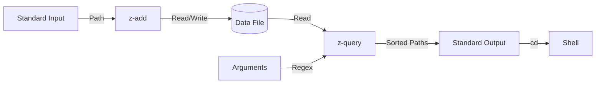

# Unix哲学に基づいたコマンド指向アーキテクチャ

モノリシックなアプリケーションではなく、**「一つのことはうまくやる (Do One Thing Well)」** というUnix哲学に従い、機能ごとに独立した小さなコマンド（またはサブコマンド）として再定義します。これらはテキストストリーム（標準入力・標準出力）を介して連携します。

## 1. コマンド構成

### `z-add` (履歴の記録・更新)
*   **責務**: ディレクトリへのアクセスを記録する。
*   **動作**:
    *   引数または標準入力からパスを受け取る。
    *   データファイル (`~/.z`) を読み込み、ランクとタイムスタンプを更新する。
    *   必要に応じてエージング（スコア減衰）処理を行う。
    *   更新されたデータをファイルに書き戻す。
*   **使用例**: `pwd | z-add`

### `z-query` (検索とスコアリング)
*   **責務**: 条件に合うディレクトリを検索し、最適な候補を出力する。
*   **動作**:
    *   データファイルを読み込む。
    *   引数のクエリ（正規表現）でフィルタリングする。
    *   Frecency アルゴリズムでスコア計算を行う。
    *   スコア順にソートし、結果を標準出力に出力する。
*   **オプション**:
    *   `--list`: ベストマッチだけでなく候補一覧を出力（`z -l` 相当）。
    *   `--rank`: ランク順でソート。
    *   `--time`: 時間順でソート。
*   **使用例**: `z-query "src" "proj"` -> `/home/user/src/project`

### `z-clean` (メンテナンス)
*   **責務**: 存在しないディレクトリの削除や、データの正規化を行う。
*   **動作**:
    *   データファイルをスキャンし、ディスク上に存在しないパスを除去して出力（または上書き）する。
    *   `-x` オプション（カレントディレクトリ削除）もここで担う。

## 2. パイプラインによる連携イメージ

各コマンドはテキストフィルタとして動作するように設計することで、柔軟な組み合わせが可能になります。

**例: 検索して移動**
```bash
# シェル関数内での実行イメージ
target=$(z-query "$@" | head -n 1)
if [ -n "$target" ]; then cd "$target"; fi
```

**例: 補完候補の生成**
```bash
# 補完関数内
z-query --list "$input" | awk '{print $1}'
```

**例: データのメンテナンス**
```bash
# 存在しないディレクトリを一括削除
cat ~/.z | z-clean > ~/.z.tmp && mv ~/.z.tmp ~/.z
```

## 3. データフロー



## 4. メリット
*   **シンプルさ**: 各コマンドは非常に単純な入力と出力を持つため、開発とデバッグが容易。
*   **柔軟性**: ユーザーは `z-query` の出力を `peco` や `fzf` などの他のフィルタツールにパイプして、インタラクティブな選択画面を作ることができる。
*   **Unix親和性**: 既存のUnixツール（grep, sort, awkなど）と自然に組み合わせられる。
